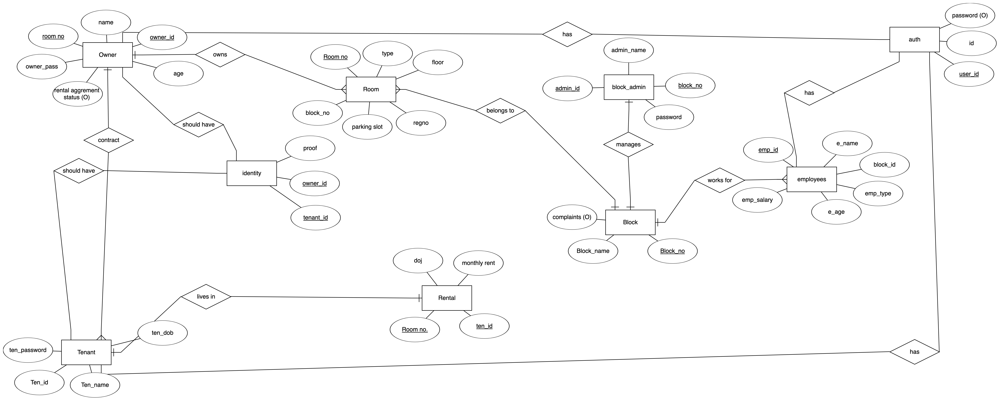

<div align="center">
 <p>
   


<p align="center">
  
</p>

# Apartment Management System

We created this project as a Mini Project for DBMS Course.

</div>

# Contents

<details>
  <summary>Click to view Table of Contents</summary>

- Project Description
- Tech Stack
- Basic Structure
  - Functionalities
  - ER Diagram
  - Screenshots of the Interface
- How to Run
</details>

# Project Description

In this project we created a Apartment management system with user interface and database support.This project is a part of our curriculum, here we solved the problem of manual entry of data in apartments by creating user interface and storing data in mysql database.

# Tech Stack

- Frontend - React JS, Tailwind css
- Backend - NodeJS, ExpressJS
- Database - MySql

# Basic Structure

## Functionalities

<details>
  <summary>click to view Functionalities</summary>
  
- Admin
  - Admin can login.
  - Admin can view the tenant and owner details.
  - Admin can create owner.
  - _Admin can delete owner._
  - _Admin can delete tenent._
  - Admin can allot parking slot.
  - Admin can view the complaints.
  - _Admin can delete the complaints._
  - Admin can see Dashboard.
- Owner
  - Owner can see the Tenant details of his/her owned room.
  - Owner can create Tenant.
  - Owner can see the complaints from his/her owned room.
  - Owner can see the Room Details.
  - Owner can see Dashboard.
- Tenant
  - Tenant can see the alloted parking slot.
  - Tenant can pay maintenance fee.
  - Tenant can raise complaints.
  - Tenant can see his/her Dashboard.

- Employee

  - Employee can see all the complaints.
  - Employee can see Total number of Complaints

- All the admins, owners, tenant, employees can login and logout.

</details>

## ER Diagram

<details>
  <summary>Click to view ER diagram</summary>
<kbd></kbd>
</details>

# How to Run

- First, clone the github repo
- Then, install the dependencies by opening the terminal with path as that of cloned github folder and do the following

  - For Client side, cd client

          npm install

  - For Server side, cd server

          npm install

- Install MySql workbench if you don't have one, and then import the export.sql file under database folder in workbench.

- Then in server folder create a file "config_sql.js" add localhost name, database name, username and password of your sql workbench and export it.

- Now to run, type the following

  - For client,

          npm run start

  - For sever,
       ```
       npm run start
       ```
- Now, you can use the project.


# Contributors
1. [Karan Gulve](https://github.com/KaranGulve4342)
2. [Harshada Borse](https://github.com/harshadaborse)
3. [Sawani Doshi](https://github.com/SawaniDoshi)
4. [Sanika Butle](https://github.com/SanikaButle)
   
`Thank you!🧑‍💻`